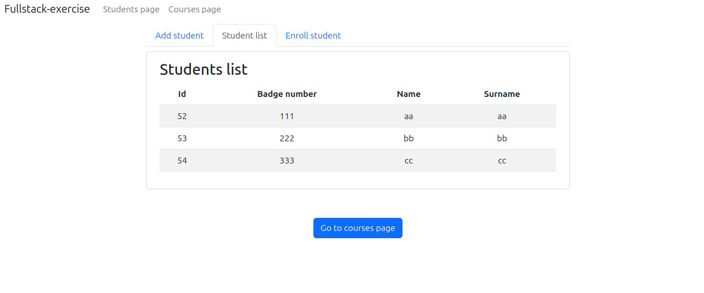
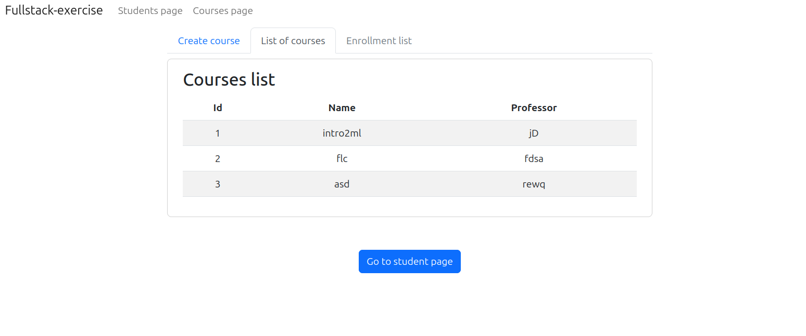

Esercizio di applicazione fullstack, fattomi fare a lavoro per famigliarizzare con Docker, Quarkus e Angular.
L'applicazione è un semplice gestionale di studenti e corsi.

Si possono aggiungere studenti ed iscriverli a corsi, così come visualizzare tali corsi e la lista di studenti ad essi iscritti.

Il tutto sviluppato in due pagine, con tre schede ognuna:
Students page

Courses page

